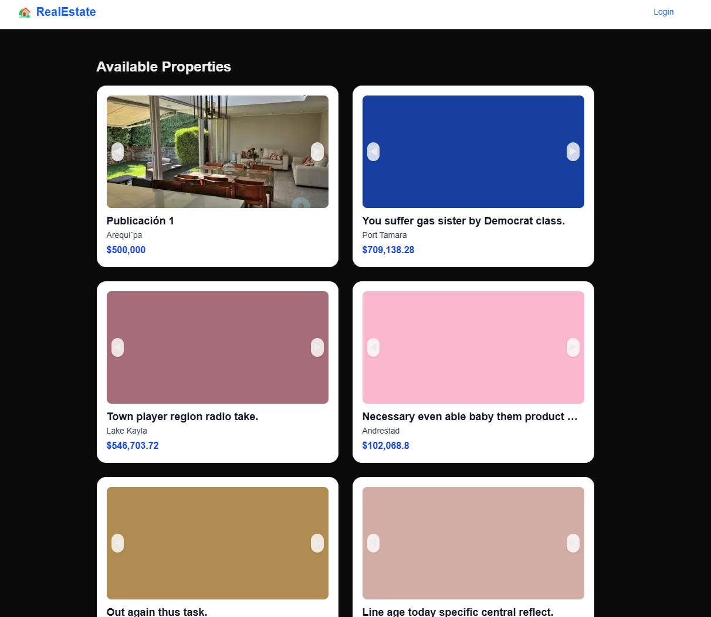
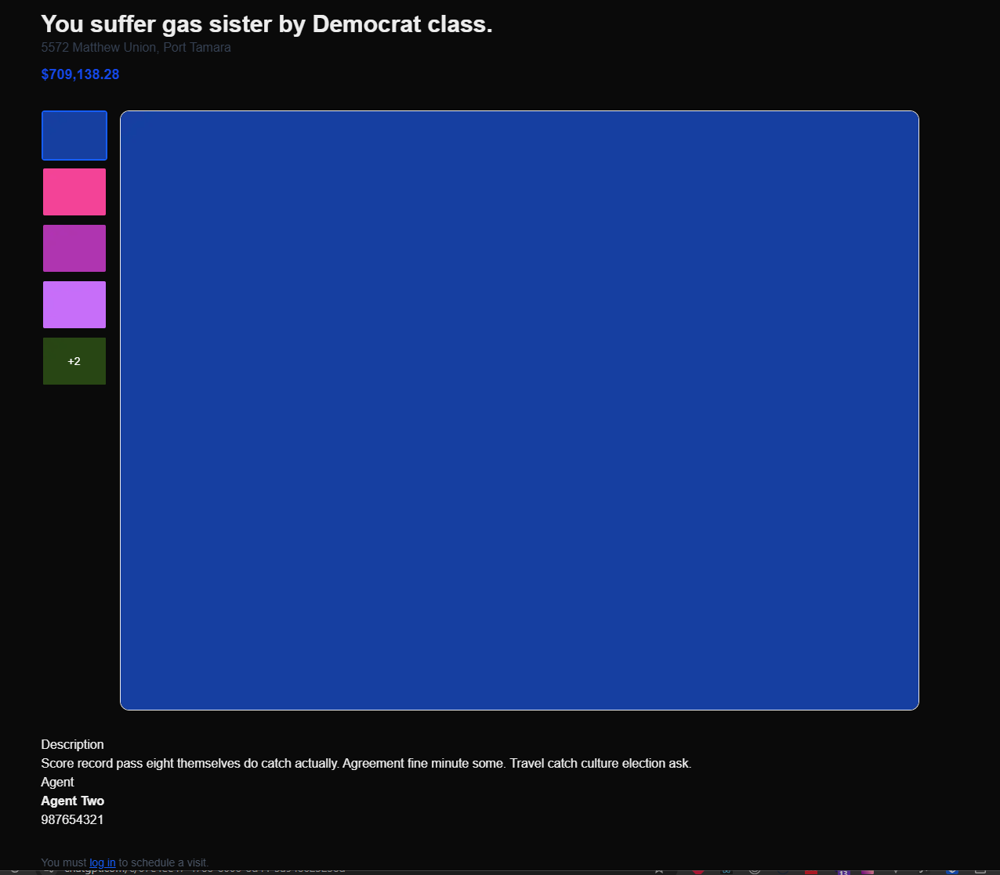
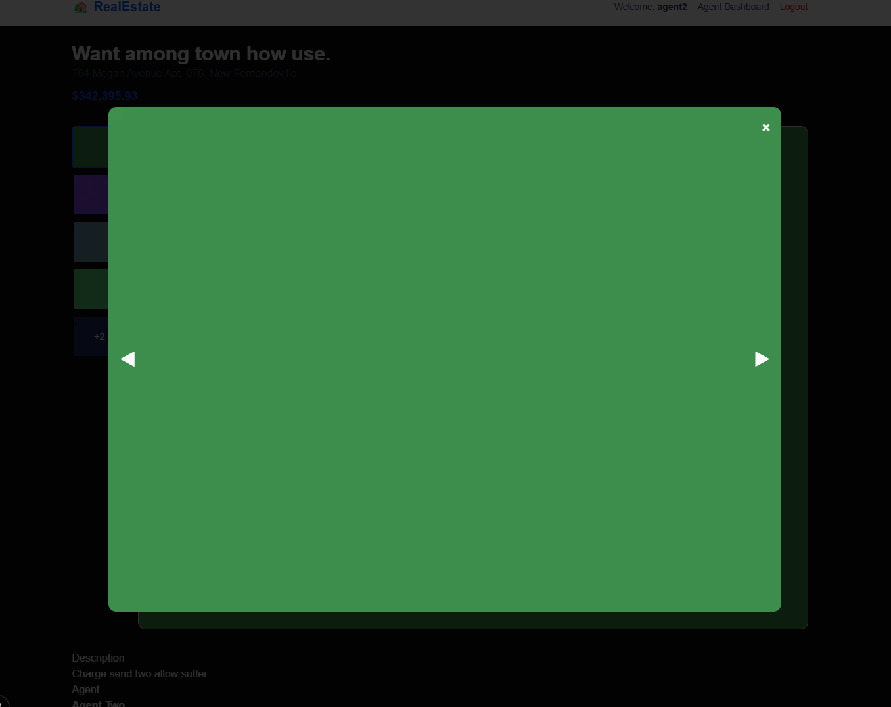
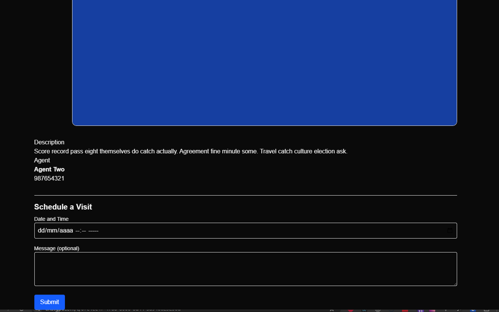
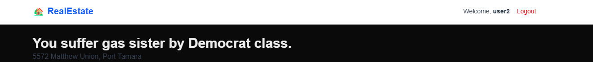
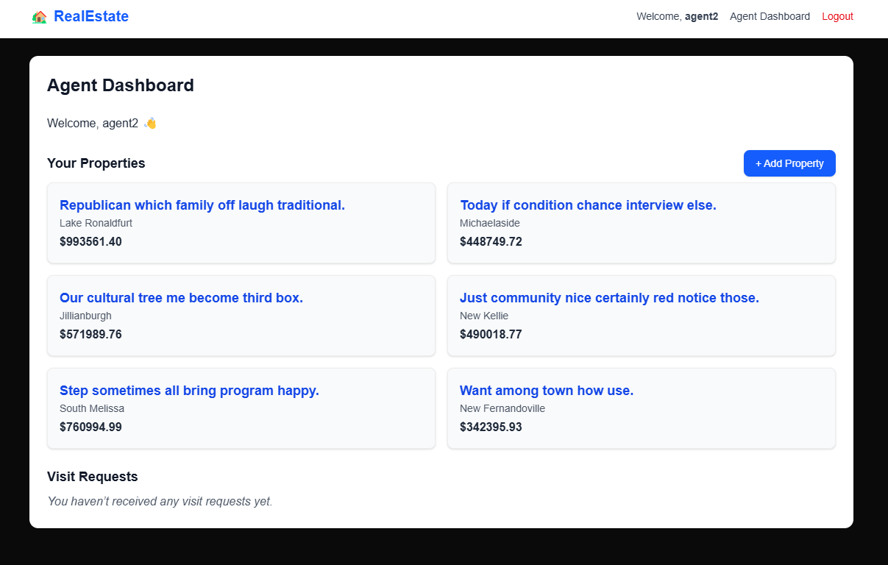

# RealEstate
Este es el nombre que le dimos a la app

## Configuración
Primero debemos clonar o descargar el repositorio
```
git clone https://github.com/josejose93/somosrentable
```

Una vez clonado, dentro de la carpeta del repo (somosrentable),
```
cd somosrentable
```
 
crearemos un ambiente virtual, ASEGUREMONOS DE TENER INSTALADO VENV (VIRTUAL ENVIRONMENT) PARA ESTO, en la consola (y siempre que necesitemos de python en la consola), llamaremos a python como "python" o "python3", en mi caso, usaremos "python"

```
python -m venv somosrentable-env
```
Entramos al ambiente virtual
```
source somosrentable-env/bin/activate
```

Luego instalamos los paquetes necesarios para que nuestro Backend funcione con pip o pip3 deacuerdo a nuestra configuración, en el ejemplo usaré pip

```
pip install -r backend/requirements.txt
```

Asegurémonos de tener una base de datos postgres (es necesario tener bien instalado postgres)
```
createdb somosrentable
```

Ya estamos listos para arrancar el backend, para esto navegamos a la carpeta mencionada, la configuración del backend la encontraremos en: [backend](https://github.com/josejose93/somosrentable/tree/main/backend) pero antes naveguemos a la carpeta con:
```
cd backend
```

## Uso de la aplicación

Una vez que tengas el backend y frontend corriendo, podrás interactuar con la app desde:

- Frontend (Next.js):  
  [http://localhost:3000](http://localhost:3000)  
  Aquí verás la interfaz web: listado de propiedades, login, panel del agente, etc.

- Backend (Django):  
  [http://localhost:8000](http://localhost:8000)  
  Este puerto expone las rutas de la API (no tiene interfaz visual). Puedes probar el login, las propiedades, etc.

- Admin de Django:  
  [http://localhost:8000/admin/](http://localhost:8000/admin/)  
  Desde aquí podrás gestionar usuarios y propiedades directamente si eres superusuario.

Si seguimos las instrucciones de la configuración del backend, ya deberíamos tener data dummy poblada hasta este punto y podemos probar la app, sino sigamos con las instrucciones desde Crear superusuario (admin) de mas abajo y agregar data desde el admin de django, si ya tenemos la data dummy podemos probar la app.

Para recordar las credenciales que nos creamos en la configuración del backend, son estas:
credenciales:
```
username agente: agent2
password agente: supersecret123456

username normal: user2
password: supersecret123456
```

Esta es la pantalla home:

donde se listan las propiedades (podemos recorrer las imágenes dando click en las flechitas), si accedemos a una de ellas podemos ver el detalle:

Si damos click a la imagen principal, podemos recorrer las imágenes en forma de galería (para cerrar la galería solo le damos click a la X de la esquina superior derecha de la imagen):


Para regresar a la página home donde se listan las propiedades, basta con darle click al icóno o nombre (RealEstate) de la app en el navbar.

como no estamos logueados no podemos agendar una visita, si nos logueamos con el user2 (usuario normal), ya podemos agendar la visita:
.
Además en el navbar podemos vernos logueados.


Si nos logueamos con el usuario agent2, el navbar cambia un poco y nos da la opción de ver link hacia una página dashboard
, en este dashboard tenemos las propiedades asociadas al agente y las citas programadas, además podemos agregar nuevas propiedades.

### 1. Crear superusuario (admin)
```
python manage.py createsuperuser
```

Esto te permitirá acceder al admin (`/admin`) para crear agentes y otros usuarios.

---

### 2. Crear un agente desde el admin

- Entra al admin: `http://localhost:8000/admin/`
- Loguéate como superusuario
- Crea un nuevo **usuario**
- Luego crea un **agente** en la sección “Agents” y asígnale ese usuario
- Este agente podrá luego iniciar sesión desde el frontend y publicar propiedades

---

### 3. Crear un usuario cliente (no agente)

- Crea otro usuario desde el admin (sin rol de agente)
- Este usuario podrá iniciar sesión desde el frontend y agendar visitas

---

### 4. Probar funcionalidades desde el frontend

1. Abre `http://localhost:3000`
2. Desde ahí podrás:
   - Navegar por las propiedades
   - Ver el detalle de una propiedad
   - Iniciar sesión
   - Si eres **agente**, acceder al panel para publicar propiedades
   - Si eres **cliente**, agendar visitas desde el detalle

---

> ⚠️ Asegúrate de que ambos servidores estén corriendo:
>
> - Django (API) con: `python manage.py runserver`
> - Next.js con: `npm run dev` desde la carpeta `frontend`
